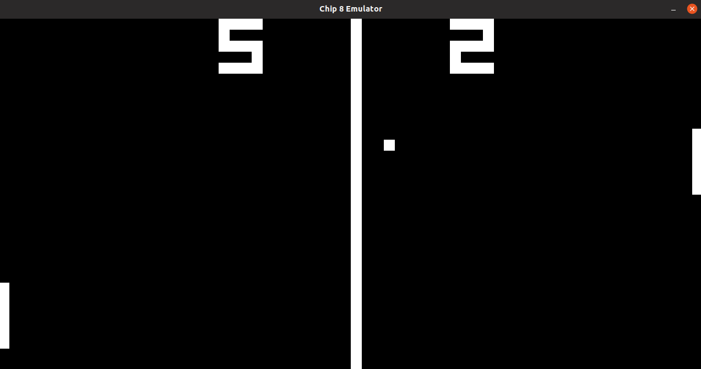

# CHIP-8 Emulator

This is an implementation of the CHIP-8 system made strictly for fun.

Linux is the only supported Operating System at this time.



## Dependencies
* GNU Make
* SDL 2.0
* GCC
* [Criterion](https://github.com/Snaipe/Criterion)

## How to Use

You can use make to build the emulator.

```
make emu
```

Then you can run the emulator by specifying a ROM file to load.

```
./dist/chip8-emulator <rom path>
```

## Controls

The controls currently are not customizable. The following tables show how your keyboard maps to CHIP-8's 4x4 keypad.

CHIP-8 Controls

| 1 | 2 | 3 | C |
|---|---|---|---|
| 4 | 5 | 6 | D |
| 7 | 8 | 9 | E |
| A | 0 | B | F |

Keyboard

| 1 | 2 | 3 | 4 |
|---|---|---|---|
| q | w | e | r |
| a | s | d | f |
| z | x | c | v |

## Debugger

This emulator has a rudimentary debugger build in. You can run the emulator in debug mode to access it.

```
./dist/chip8-emulator <rom path> --debug
```

The debugger currently supports the following commands...
* `exit`: Exits the process.
* `step`: Executes the next instruction.
* `next`: Displays the next instruction.
* `previous`: Displays the previous instruction.
* `register <v>`: Displays the contents of a single CPU register (can be `dt`, `st`, `I`, or any number 0-15).
* `registers`: Displays the contents of every CPU register.
* `memory <start> <end> [chunk size]`: Displays the contents of memory from addresses start:end (given in hexidecimal form). You can also supply a chunk size argument of 1, 2, or 4 - which will specify whether the command will display the memory in 8-bit, 16-bit, or 32-bit format.

    Example: `memory 0x200 0x203 2`
    
    Output
    ```
    [0x200] 0x2f8b
    [0x202] 0xffff
    ```

* `break address <memory address (in Hex)>`: Sets a breakpoint for the instruction at the given memory address.
* `break remove-address <memory address (in Hex)>`: Removes the breakpoint at the given memory  address.
* `break list-address`: Lists all addresses that have breakpoints.
* `continue`: Resumes execution until the next breakpoint is hit.
* `stack full`: Displays the entire stack.
* `stack peek`: Displays the top value of the stack.
* `context <n>`: Shows the n instructions surrounding the instruction being pointed to by the PC.

## REPL

This emulator also has a basic REPL mode, which allows you to run instructions detached from any program.

```
./dist/chip8-emulator --repl
```

From there you can enter in instructions in hexidecimal format. You can see [Cowgod's CHIP-8 Technical Reference](http://devernay.free.fr/hacks/chip8/C8TECH10.HTM#3.0) to learn how to write your own instructions.

For example, to clear the screen in REPL mode, you would simply type...

```
>>> 00E0
```

## Unit Tests

This emulator uses [Criterion](https://github.com/Snaipe/Criterion) for its unit tests. There is a make command for running the unit tests.

```
make test
```

## Resources and Credits

I used the following resources so kudos to all of the authors...
* [Cowgod's CHIP-8 Technical Reference](http://devernay.free.fr/hacks/chip8/C8TECH10.HTM#3.0)
* [LazyFoo Productions - Beginning Game Programming](https://lazyfoo.net/tutorials/SDL/index.php#Hello%20SDL)